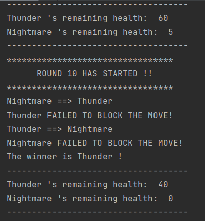

# Boxing Game

### This program is a program that represents the competition between two boxers in written form.

---

## Details
* This repository has
    * a Main.java class in which the program runs and prints the competition
information and the winner boxer on the terminal.
    * a Fighter.java class in which fighters-related qualities and
      methods are defined.
    * a Ring.java class in which rules-related qualities and
      methods are defiined.
  

* Two fighters and one ring are determined. 
* The competition continues until one of the boxers has 0 health.
* Boxers start their moves with a 50% probability in each round.
* With the defined probability, boxers have a chance to block moves.
  
* Program output for the random run and last round will be as:

---

## Installation
Clone the project.
>  https://github.com/aslihanhasar/patika.dev-practices.git

---

## Usage
After cloning the project, open it with the ide you used.

---

## Requirements
* JDK (version 19 is recommended)

---

## Author
**Aslıhan Hasar**

* GitHub: [aslıhanhasar](https://github.com/aslihanhasar)
* LinkedIn: [aslıhanhasar](https://www.linkedin.com/in/asl%C4%B1hanhasar
  )
---

## Contributing
Contributions, issues, and feature requests are welcome.

---

## License

[MIT](https://choosealicense.com/licenses/mit/)

---

## Show Your Suport
Give me a &#11088; if you like the project.

---

## Acknowledgments
* This repo is created for my homeworks on www.patika.dev.