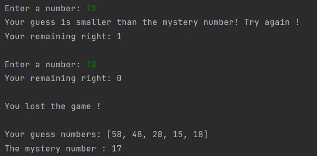

# Guessing The Mystery Number ! 

### This program represent a game of number guessing.  

---

## Details
* This game has these rules:
    * The user has 5 right to guess the mystery number.
    * The mystery number is a random value. 
    * If the user guesses the number before the right is 0
then the user wins the game. 
    * The number received from the user must be between 0-100.
    * All guess numbers are printed in an array at the end of the game. 

The program output will be as : 

---

## Installation
Clone the project.
> https://github.com/aslihanhasar/patika.dev-practices.git

---

## Usage
After cloning the project, open it with the ide you used.

---

## Requirements
* JDK (version 19 is recommended)

---

## Author
**Aslıhan Hasar**

* GitHub: [miyendisa](https://github.com/miyendisa)
* LinkedIn: [aslıhanhasar](https://www.linkedin.com/in/asl%C4%B1hanhasar
  )
---

## Contributing
Contributions, issues, and feature requests are welcome.

---

## License

[MIT](https://choosealicense.com/licenses/mit/)

---

## Show Your Suport
Give me a &#11088; if you like the project.

---

## Acknowledgments
* This repo is created for my homeworks on www.patika.dev.