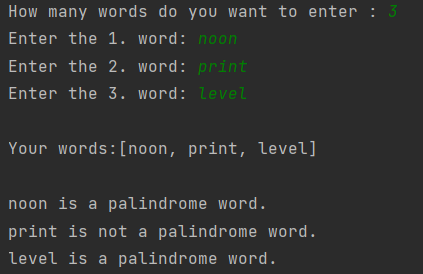

# Check Palindrome Words

### This program checks whether the words in an array are palindrome words and prints them to the screen.

---

## Details
* Information on how many words to check is received from the user.
* Words are received from the user.

* Program input and output will be as:

  

---

## Installation
Clone the project.
> https://github.com/aslihanhasar/patika.dev-practices.git

---

## Usage
After cloning the project, open it with the ide you used.

---

## Requirements
* JDK (version 19 is recommended)

---

## Author
**Aslıhan Hasar**

* GitHub: [miyendisa](https://github.com/miyendisa)
* LinkedIn: [aslıhanhasar](https://www.linkedin.com/in/asl%C4%B1hanhasar
  )
---

## Contributing
Contributions, issues, and feature requests are welcome.

---

## License

[MIT](https://choosealicense.com/licenses/mit/)

---

## Show Your Suport
Give me a &#11088; if you like the project.

---

## Acknowledgments
* This repo is created for my homeworks on www.patika.dev.